# DSHB V86-RC2 生产阶段一 · 阻塞项跟踪与跨团队同步文档

| 元数据 | 值 |
|--------|-----|
| **文档编号** | DSHB-V86-RC2-PROD-BT-001 |
| **版本** | v1.0 |
| **分支** | `feature/v85-chart-template` |
| **创建日期** | 2026-10-04 |
| **阶段** | Production Phase 1 (产切一阶段) |
| **约束条件** | `NO_ZHIJI_API_CALL=FALSE` / `NO_MODIFY_V85=TRUE` / `NO_OVERWRITE=TRUE` / `BRANCH_LOCKED=TRUE` |
| **跨团队同步要求** | 所有输出、进度变更、风险更新必须同步 DSHE & HERMES |

---

## 目录

1. [执行摘要](#1-执行摘要)
2. [阻塞项跟踪表](#2-阻塞项跟踪表)
3. [风险台账更新](#3-风险台账更新-14项)
4. [关键路径跟踪](#4-关键路径跟踪)
5. [三方同步日志](#5-三方同步日志)
6. [周度同步节奏定义](#6-周度同步节奏定义)
7. [异常检测规则](#7-异常检测规则-8类)
8. [观察节点状态](#8-观察节点状态-7步)
9. [跨团队变更通知记录](#9-跨团队变更通知记录)
10. [约束合规声明](#10-约束合规声明)

---

## 1. 执行摘要

### 1.1 当前状态总览

| 指标 | 当前值 | 目标值 | 状态 |
|------|--------|--------|------|
| 生产阶段 | Stage 1 (产切一阶段) | 3 阶段完成 | 🟡 进行中 |
| 阻塞项 | 2 (B-01, B-02) | 0 未关闭 | 🟡 待解除 |
| 风险项 | 14 (高0/中7/低7) | 中/低可控 | 🟢 受控 |
| 关键路径 | ENG-01 → MON-01 → MON-03 → MON-04 (~60h) | ≤ 72h | 🟢 在可控范围 |
| 总工作量 | ~154h | ~160h | 🟢 在预算内 |
| 三方同步 | 已建立机制 | 每工作日均步 | 🟢 已建立 |

### 1.2 核心决策点

| 决策点 | 截止时间 | 决策内容 | 影响范围 |
|--------|----------|----------|----------|
| D-01: zhiji_id 确认 | T-24h | 确认最终 zhiji_id 映射，关闭 B-01 | ENG-01, ENG-03, MON-01 |
| D-02: API 文档交付 | T-12h | API 文档 V1.0 交付，关闭 B-02 | ENG-04 |
| D-03: 数据源一致性验证 | T+0h | DSHE 验证显示层映射一致性 | 三方 |
| D-04: 首轮异常检测 | T+2h | MON-03 首轮异常检测结果 | 三方 |
| D-05: 产切确认 | T+24h | HERMES 审计验证通过，确认产切 | 三方 |

### 1.3 三方角色分工

| 团队 | 角色定位 | 核心职责 |
|------|----------|----------|
| **DSHB** | 执行方 | 执行 ENG/MON 开发、zhiji_id 确认、对齐任务、阻塞项推进 |
| **DSHE** | 映射验证方 | 更新显示层映射、验证数据一致性、提供映射变更通知 |
| **HERMES** | 审计验证方 | 审计验证、全局验证、约束合规检查、放行签署 |

---

## 2. 阻塞项跟踪表

### 2.1 阻塞项详情

| 编号 | 名称 | 状态 | 严重度 | 负责人 | ETA | 依赖项 | 缓解措施 | 同步状态 |
|------|------|------|--------|--------|-----|--------|----------|----------|
| **B-01** | 数据源文档 (Data Source Documentation) | 🟡 **待解除** | 🔴 **高** | DSHB-李工 | 2026-10-04 T-24h (预计 2026-10-03 14:00) | DSHB 数据源团队、DSHE 映射团队 | ① 预填数据源清单模板并分发各团队；② DSHE 提前提供当前映射草稿供交叉核对；③ 如 zhiji_id 存在未确认项，采用临时占位 ID `ZHJI-TEMP-{序号}` 并在确认后批量替换；④ DSHB 每日 10:00 同步进度至 HERMES | ✅ 已同步 DSHE / HERMES |
| **B-02** | API 文档 (API Documentation) | 🟡 **待解除** | 🔴 **高** | DSHB-王工 | 2026-10-04 T-12h (预计 2026-10-04 02:00) | DSHB API 团队 | ① 采用 OpenAPI 3.1 标准提前生成初版草稿；② ENG-04 开发可基于草稿先行启动，待正式版发布后做差异调整；③ 同步 DSHE 确认可消费的字段定义 | ✅ 已同步 DSHE / HERMES |

### 2.2 阻塞项依赖关系图

```
B-01 (数据源文档) ────────────────┐
   │                               │
   ├──→ ENG-01 (开发) ──→ MON-01 (监控部署) ──→ MON-03 (异常检测) ──→ MON-04 (报告生成)
   │
   ├──→ ENG-03 (对齐)
   │
   └──→ MON-01 (监控部署)
                            ↑
B-02 (API文档) ─────────────┘
   │
   └──→ ENG-04 (开发)
```

### 2.3 阻塞项解除检查清单

| 检查项 | B-01 | B-02 | 验证方 | 检查时间 |
|--------|------|------|--------|----------|
| 文档 V1.0 交付 | ☐ | ☐ | DSHB | T-24h / T-12h |
| 关键字段确认 (zhiji_id) | ☐ | ☐ | DSHE | T-24h |
| API 端点可消费性验证 | ☐ | ☐ | DSHE | T-12h |
| 异常检测规则字段映射确认 | ☐ | ☐ | DSHB+DSHE | T-12h |
| 文档版本号记录 | ☐ | ☐ | HERMES | 交付时 |
| 变更通知已发送 | ☐ | ☐ | HERMES | 交付时 |

### 2.4 阻塞项升级路径

| 级别 | 触发条件 | 响应时间 | 处理方 |
|------|----------|----------|--------|
| L1 | 阻塞项未能在 ETA 前解除 | 立即 | DSHB 负责人 + 项目经理 |
| L2 | 阻塞项延误 > 4h | 2h 内 | DSHB PM + DSHE 对接人 + HERMES 审计员 |
| L3 | 阻塞项延误 > 8h 且影响关键路径 | 1h 内 | DSHB PM + DSHE 技术负责人 + HERMES 全局验证负责人 |

---

## 3. 风险台账更新 (14项)

### 3.1 风险分布概览

```
严重度分布:
  高 (High)  : 0 项 (0%)
  中 (Medium): 7 项 (50%)
  低 (Low)   : 7 项 (50%)
```

### 3.2 完整风险台账

| 编号 | 风险描述 | 来源 | 严重度 | 概率 | 影响 | 当前状态 | 缓解措施 | 责任人 | 关联阻塞项 |
|------|----------|------|--------|------|------|----------|----------|--------|-----------|
| **R-001** | zhiji_id 映射不一致导致数据链路断裂 | DSHB 原始 | 🟡 中 | 高 | 数据错误、链路中断 | 🟡 监控中 | ① 建立 zhiji_id 映射对照表；② 每 4h 与 DSHE 交叉核对；③ 启用双写验证模式 | DSHB-李工 | B-01 |
| **R-002** | 数据源文档延迟交付影响下游开发启动 | DSHB 原始 | 🟡 中 | 中 | 开发进度延误 4-8h | 🟡 监控中 | ① 分阶段交付（先交付核心字段，补充说明后行）；② DSHE 提供映射草稿先行 | DSHB-李工 | B-01 |
| **R-003** | API 文档版本不一致导致集成失败 | DSHB 原始 | 🟡 中 | 中 | 集成测试失败，需回滚 | 🟡 监控中 | ① 锁定 API 版本至 OpenAPI 3.1；② 差异检测报告每日更新；③ DSHE 同步验证消费能力 | DSHB-王工 | B-02 |
| **R-004** | MON-01 监控部署依赖 ENG-01 输出 | DSHB 原始 | 🟡 中 | 高 | 关键路径阻塞 | 🟢 缓解中 | ① MON-01 提前完成基础框架搭建（不依赖数据源）；② 待 ENG-01 数据就绪后热插入配置 | DSHB-张工 | B-01 |
| **R-005** | 异常检测阈值设置不合理导致误报率过高 | DSHB 原始 | 🟢 低 | 中 | 运维疲劳、告警疲劳 | 🟢 受控 | ① 采用动态基线算法（基于历史 7 日均值 + 2σ 浮动）；② 上线后 T+24h 根据实际数据调整阈值 | DSHB-张工 | — |
| **R-006** | DSHE 映射变更未及时通知 DSHB | DSHB 原始 | 🟡 中 | 低 | 数据链路映射错误 | 🟢 受控 | ① 建立 DSHE 变更通知通道；② DSHB 每日 10:00 主动拉取映射变更日志；③ 映射变更触发三方即时确认流程 | DSHB-PM | — |
| **R-007** | 分支锁定期间发现需修改 V85 代码 | DSHB 原始 | 🟢 低 | 低 | 违反 BRANCH_LOCKED 约束 | 🟢 受控 | ① 所有变更需求必须走 V86 分支；② V85 代码只读检查；③ HERMES 在审计中检查分支合规性 | DSHB-PM | — |
| **R-008** | 三方同步延迟导致信息不对称 | DSHB 原始 | 🟢 低 | 中 | 决策延迟、重复工作 | 🟢 受控 | ① 定义固定同步时间（见 §6）；② 关键变更即时同步，不等例会；③ HERMES 提供同步完成状态检查 | DSHB-PM | — |
| **R-009** | MON-03 异常检测结果不准确 | DSHB 原始 | 🟡 中 | 低 | 错误决策、误报告警 | 🟢 受控 | ① 首轮检测结果由 HERMES 交叉验证；② 保留原始日志供回溯分析；③ 人工复核前 24h 异常检测输出 | DSHB-张工 | — |
| **R-010** | HERMES 审计验证不通过需回滚 | DSHB 原始 | 🟡 中 | 低 | 返工成本高、进度延误 | 🟢 受控 | ① 提前共享审计检查清单；② 每阶段完成前由 HERMES 预审；③ 回滚方案已预先编写（见 §9.4） | DSHB-PM | — |
| **R-011** | 生产阶段资源争用导致关键路径延误 | DSHB 原始 | 🟢 低 | 低 | 关键路径延误 | 🟢 受控 | ① 关键路径任务优先级 P0；② 非必要任务延后至 Stage 2；③ DSHB PM 每 4h 检查资源分配 | DSHB-PM | — |
| **R-012** | 误报率切换策略未定义导致 DSHE 显示层异常 | DSHE 评审新增 | 🟡 中 | 中 | DSHE 显示层映射与 DSHB 输出不一致 | 🟡 监控中 | ① 联合 DSHE 定义误报率切换策略（详见 R-012 子任务）；② 策略文档交付后三方确认；③ 设置 24h 灰度切换窗口 | DSHB-PM + DSHE-陈工 | — |
| **R-013** | API 文档不可消费导致 DSHE 显示层集成失败 | DSHE 评审新增 | 🟡 中 | 中 | DSHE 显示层集成失败、需重写 | 🟡 监控中 | ① ENG-04 启动前 DSHE 预审 API 文档消费性；② 不可消费字段标记后先行绕过；③ 建立 DSHE-DSHB API 字段消费确认表 | DSHB-王工 + DSHE-陈工 | B-02 |
| **R-014** | IT 集成延迟影响 DSHE 与 DSHB 数据对接 | DSHE 评审新增 | 🟢 低 | 中 | 数据对接延迟 4-12h | 🟢 受控 | ① IT 集成排期已锁定，与 V86 产切时间表对齐；② 备用数据通道（文件交换）已预留；③ IT 集成完成后 DSHE 验证数据完整性 | IT-赵工 | — |

### 3.3 风险趋势记录

| 检查日期 | 高风险 | 中风险 | 低风险 | 新增风险 | 关闭风险 | 备注 |
|----------|--------|--------|--------|----------|----------|------|
| 2026-10-04 | 0 | 7 | 7 | R-012, R-013, R-014 | — | PREP 阶段风险台账建立，DSHE 评审新增 3 项 |

---

## 4. 关键路径跟踪

### 4.1 关键路径定义

```
ENG-01 (数据开发) ──→ MON-01 (监控部署) ──→ MON-03 (异常检测) ──→ MON-04 (报告生成)
        14h                18h                    16h                     12h
```

**总计**: ~60h | **缓冲**: ~12h (20%) | **关键路径总预算**: ~72h

### 4.2 关键路径节点详情

| 节点 | 任务描述 | 前置依赖 | 计划开始 | 计划结束 | 预计耗时 | 实际耗时 | 偏差 | 状态 | 负责人 |
|------|----------|----------|----------|----------|----------|----------|------|------|--------|
| **ENG-01** | 数据源开发：数据接入、清洗、zhiji_id 映射 | B-01 解除 | 2026-10-04 14:00 | 2026-10-05 04:00 | 14h | — | — | 🔵 待启动 | DSHB-李工 |
| **MON-01** | 监控部署：数据采集管道搭建、指标接入 | ENG-01 完成 | 2026-10-05 04:00 | 2026-10-05 22:00 | 18h | — | — | 🔵 待启动 | DSHB-张工 |
| **MON-03** | 异常检测：检测规则部署、阈值配置、首次运行 | MON-01 完成 | 2026-10-05 22:00 | 2026-10-06 14:00 | 16h | — | — | 🔵 待启动 | DSHB-张工 |
| **MON-04** | 报告生成：检测报告输出、三方分发、签入 | MON-03 完成 | 2026-10-06 14:00 | 2026-10-07 02:00 | 12h | — | — | 🔵 待启动 | DSHB-张工 |

### 4.3 关键路径依赖链

```mermaid
graph LR
    B01[B-01 数据源文档] --> ENG01[ENG-01 数据开发]
    ENG01 --> MON01[MON-01 监控部署]
    MON01 --> MON03[MON-03 异常检测]
    MON03 --> MON04[MON-04 报告生成]
    MON04 --> HERMES_AUDIT[HERMES 审计验证]
    HERMES_AUDIT --> PROD_RELEASE[产切确认]
    
    style B01 fill:#ff6b6b,color:#fff
    style ENG01 fill:#ffa500,color:#fff
    style MON01 fill:#ffa500,color:#fff
    style MON03 fill:#ffa500,color:#fff
    style MON04 fill:#ffa500,color:#fff
```



### 4.4 关键路径风险与缓冲

| 风险因素 | 影响时长 | 缓冲量 | 应对措施 |
|----------|----------|--------|----------|
| B-01 解除延迟 | +4~8h | 12h 缓冲可覆盖 | 分阶段交付 + 临时占位 ID |
| ENG-01 数据质量问题 | +2~6h | 12h 缓冲可覆盖 | 自动化数据质量校验前置 |
| MON-01 部署环境不稳定 | +1~4h | 12h 缓冲可覆盖 | 预构建部署脚本，减少现场调试 |
| MON-03 阈值调试 | +1~3h | 12h 缓冲可覆盖 | 动态基线算法减少手动调参 |
| 累计风险 | +8~21h | 12h 缓冲 | ⚠️ 需关注，超出缓冲需 L2 升级 |

### 4.5 关键路径追踪时间线

```
T-24h  ● 2026-10-03 14:00  B-01 目标解除 + D-01 zhiji_id 确认
       │
T-12h  ● 2026-10-04 02:00  B-02 目标解除
       │
T+0h   ● 2026-10-04 14:00  ENG-01 启动
       │  ┌──── ENG-01: 数据开发 (14h) ────────────────┐
T+14h  ● 2026-10-05 04:00  MON-01 启动
       │  ┌──── MON-01: 监控部署 (18h) ────────────────┐
T+32h  ● 2026-10-05 22:00  MON-03 启动
       │  ┌──── MON-03: 异常检测 (16h) ────────────────┐
T+48h  ● 2026-10-06 14:00  MON-04 启动
       │  ┌──── MON-04: 报告生成 (12h) ────────────────┐
T+60h  ● 2026-10-07 02:00  MON-04 完成 → HERMES 审计
       │
T+72h  ● 2026-10-07 14:00  缓冲上限（超时则 L2 升级）
```

---

## 5. 三方同步日志

### 5.1 同步日志表

| 序号 | 时间戳 | 同步发起方 | 同步内容 | 类型 | 接收方 | 接收确认 | 关联风险/阻塞 |
|------|--------|-----------|----------|------|--------|----------|--------------|
| SYNC-001 | 2026-10-04 09:00 | DSHB-PM | PREP 阶段风险台账建立完成，14 项风险已定级（高0/中7/低7），含 DSHE 评审新增 3 项 (R-012/R-013/R-014) | 风险通知 | DSHE, HERMES | DSHE ✅ 10:15 / HERMES ✅ 11:00 | R-012, R-013, R-014 |
| SYNC-002 | 2026-10-04 09:00 | DSHB-PM | 阻塞项 B-01 (数据源文档) 确认，ETA 2026-10-03 14:00，依赖 ENG-01/ENG-03/MON-01 | 阻塞通知 | DSHE, HERMES | DSHE ✅ 10:20 / HERMES ✅ 11:05 | B-01 |
| SYNC-003 | 2026-10-04 09:00 | DSHB-PM | 阻塞项 B-02 (API 文档) 确认，ETA 2026-10-04 02:00，依赖 ENG-04 | 阻塞通知 | DSHE, HERMES | DSHE ✅ 10:20 / HERMES ✅ 11:05 | B-02 |
| SYNC-004 | 2026-10-04 10:00 | DSHE-陈工 | 显示层映射草稿 V0.5 已发送至 DSHB，覆盖 zhiji_id 映射及数据字段对应关系 | 数据同步 | DSHB, HERMES | DSHB ✅ 10:30 / HERMES ✅ 11:10 | R-001, R-006 |
| SYNC-005 | 2026-10-04 10:30 | DSHB-李工 | B-01 进展：数据源清单模板已预填 80% 核心字段，剩余 20% 为 zhiji_id 映射待 DSHE 确认 | 进度更新 | DSHE, HERMES | DSHE ✅ 11:00 / HERMES ✅ 11:30 | B-01, R-001 |
| SYNC-006 | 2026-10-04 14:00 | DSHB-王工 | B-02 进展：OpenAPI 3.1 初版草稿已生成，覆盖 24 个端点，DSHE 已确认其中 20 个端点字段可消费 | 进度更新 | DSHE, HERMES | DSHE ✅ 14:30 / HERMES ✅ 15:00 | B-02, R-003, R-013 |
| SYNC-007 | 2026-10-04 15:00 | HERMES-审计员 | 审计检查清单已分发 DSHB+DSHE，含 42 项检查点，覆盖约束合规、数据一致性、异常检测有效性 | 审计通知 | DSHB, DSHE | DSHB ✅ 15:30 / DSHE ✅ 15:45 | — |
| SYNC-008 | 2026-10-04 16:00 | DSHB-PM | 关键路径时间表已锁定（ENG-01→MON-01→MON-03→MON-04，总预算 60h，缓冲 12h），三方确认 | 计划确认 | DSHE, HERMES | DSHE ✅ 16:30 / HERMES ✅ 17:00 | — |

### 5.2 同步状态看板

| 同步维度 | 已同步 | 待同步 | 同步率 | 趋势 |
|----------|--------|--------|--------|------|
| 阻塞项通知 | 2/2 | — | 100% | 🟢 |
| 风险变更 | 3/14 (新增项) | 11 (待变更) | 21% | 🟡 |
| 进度更新 | 2 | 按节点更新 | 🟢 | 🟢 |
| 计划确认 | 1 | 按计划确认 | 🟢 | 🟢 |
| 审计通知 | 1 | 按检查点更新 | 🟢 | 🟢 |

---

## 6. 周度同步节奏定义

### 6.1 固定同步日历

| 日期 | 时间 | 同步类型 | 参与方 | 议程 | 输出物 |
|------|------|----------|--------|------|--------|
| **每日 09:30** | 15min | 每日站会 | DSHB, DSHE, HERMES | 阻塞项状态、当日任务、风险更新 | 当日同步纪要 |
| **每日 10:00** | 即时 | 主动拉取 | DSHB ← DSHE | DSHE 映射变更日志 | 变更差异报告 |
| **每日 18:00** | 即时 | 即时推送 | DSHB → DSHE, HERMES | 当日进度、次日计划、风险变更 | 日报 |
| **T+24h** | 30min | 首轮观察 | DSHB, DSHE, HERMES | 首轮异常检测结果、数据一致性 | 首轮观察报告 |
| **T+72h** | 45min | 缓冲检查 | DSHB, DSHE, HERMES | 关键路径进度、缓冲消耗、升级决策 | 缓冲检查报告 |

### 6.2 同步类型与响应要求

| 同步类型 | 渠道 | 响应要求 | 超时升级 |
|----------|------|----------|----------|
| **即时同步** (关键变更/阻塞/风险升级) | IM + 邮件双通道 | 15min 内确认接收 | 30min 未确认 → IM @负责人 |
| **计划同步** (每日站会/周度) | 会议 + 纪要 | 会议结束前确认 | — |
| **数据同步** (映射变更/数据交付) | 文件 + IM 确认 | 2h 内确认 | 4h 未确认 → PM 介入 |
| **审计同步** (审计检查/验证) | HERMES 专用通道 | 按检查点要求 | 检查点延误 → L1 升级 |

### 6.3 同步完成检查清单

每次同步后，HERMES 执行以下检查：

```
□ 同步内容已记录于 SYNC-XXX
□ 接收方已确认 (时间戳 < 15min)
□ 风险/阻塞项状态已更新
□ 关键路径时间线已更新
□ 变更已通知至所有相关方
□ HERMES 审计记录已更新
```

---

## 7. 异常检测规则 (8类)

### 7.1 规则总览

| 编号 | 规则名称 | 类型 | 严重度 | 检测频率 | 阈值 | 通知方 |
|------|----------|------|--------|----------|------|--------|
| **ADR-01** | zhiji_id 映射完整性检查 | 数据一致性 | 🔴 高 | 每 15min | 映射缺失率 > 0% | DSHB + DSHE + HERMES |
| **ADR-02** | 数据源连接健康检查 | 基础设施 | 🔴 高 | 每 5min | 连接失败率 > 10% | DSHB + HERMES |
| **ADR-03** | 数据延迟检测 | 性能 | 🟡 中 | 每 30min | 延迟 > 5min | DSHB |
| **ADR-04** | 异常检测误报率 | 检测质量 | 🟡 中 | 每 1h | 误报率 > 20% | DSHB + DSHE |
| **ADR-05** | 数据量突增/突降 | 数据异常 | 🟡 中 | 每 15min | 偏离均值 > 3σ | DSHB |
| **ADR-06** | API 响应时间异常 | 性能 | 🟢 低 | 每 30min | P99 响应时间 > 500ms | DSHB |
| **ADR-07** | 监控管道数据丢失 | 数据完整性 | 🔴 高 | 每 15min | 丢失率 > 0.1% | DSHB + HERMES |
| **ADR-08** | 约束合规检查 (V85 未修改) | 合规 | 🔴 高 | 每 4h | 任何 V85 代码变更 | DSHB + HERMES |

### 7.2 规则详情

#### ADR-01: zhiji_id 映射完整性检查

| 属性 | 值 |
|------|-----|
| **检测逻辑** | 遍历所有数据源记录，校验 zhiji_id 字段是否存在且非空，并校验该 ID 是否存在于 DSHE 提供的映射表中 |
| **严重度** | 🔴 高 — 映射缺失导致数据链路断裂，直接影响下游分析 |
| **检测频率** | 每 15min 一次 |
| **阈值** | 缺失率 > 0%（零容忍） |
| **触发动作** | ① 标记缺失记录；② 通知 DSHB + DSHE + HERMES；③ 暂停受影响管道的数据处理 |
| **恢复条件** | 映射补齐后验证通过 |

#### ADR-02: 数据源连接健康检查

| 属性 | 值 |
|------|-----|
| **检测逻辑** | 对每个数据源执行连接测试（TCP 连接 + 认证握手），统计失败率 |
| **严重度** | 🔴 高 — 连接失败导致数据采集中断 |
| **检测频率** | 每 5min 一次 |
| **阈值** | 连接失败率 > 10%（连续 3 次检测即触发） |
| **触发动作** | ① 记录失败源；② 启动自动重连；③ 失败源列表通知 HERMES |

#### ADR-03: 数据延迟检测

| 属性 | 值 |
|------|-----|
| **检测逻辑** | 计算数据从产生到被处理的时间差，对比预期延迟基线 |
| **严重度** | 🟡 中 — 延迟影响实时监控时效性 |
| **检测频率** | 每 30min 一次 |
| **阈值** | 延迟 > 5min |
| **触发动作** | ① 标记延迟管道；② 检查上游资源；③ 记录至延迟日志 |

#### ADR-04: 异常检测误报率

| 属性 | 值 |
|------|-----|
| **检测逻辑** | 对比异常检测输出与人工标注/历史基线，计算误报率 = 误报数 / 总告警数 |
| **严重度** | 🟡 中 — 过高误报率导致告警疲劳，影响有效告警响应 |
| **检测频率** | 每 1h 一次 |
| **阈值** | 误报率 > 20% |
| **触发动作** | ① 通知 DSHB + DSHE（关联 R-012 误报率切换策略）；② 触发阈值调整流程；③ 记录至误报分析日志 |
| **关联风险** | R-012 (误报率切换策略) |

#### ADR-05: 数据量突增/突降

| 属性 | 值 |
|------|-----|
| **检测逻辑** | 基于滑动窗口统计当前数据量，与历史 7 日均值对比，计算偏离程度 |
| **严重度** | 🟡 中 — 突增可能是数据源异常或注入，突降可能是管道故障 |
| **检测频率** | 每 15min 一次 |
| **阈值** | 偏离均值 > 3σ（标准差） |
| **触发动作** | ① 标记异常管道；② 检查上游数据源；③ 如为突降则触发 ADR-02 检查 |

#### ADR-06: API 响应时间异常

| 属性 | 值 |
|------|-----|
| **检测逻辑** | 统计 API 端点的 P99 响应时间，对比基线值 |
| **严重度** | 🟢 低 — 响应变慢影响用户体验但不影响数据正确性 |
| **检测频率** | 每 30min 一次 |
| **阈值** | P99 响应时间 > 500ms |
| **触发动作** | ① 记录至性能日志；② 标记需关注的端点；③ 持续超时则关联 ADR-02 检查 |

#### ADR-07: 监控管道数据丢失

| 属性 | 值 |
|------|-----|
| **检测逻辑** | 对比数据源输出计数与管道输入计数，计算丢失率 |
| **严重度** | 🔴 高 — 数据丢失直接导致分析结果不准确 |
| **检测频率** | 每 15min 一次 |
| **阈值** | 丢失率 > 0.1% |
| **触发动作** | ① 标记丢失位置；② 尝试从缓冲恢复；③ 无法恢复则记录至丢失日志并通知 HERMES |

#### ADR-08: 约束合规检查 (V85 未修改)

| 属性 | 值 |
|------|-----|
| **检测逻辑** | 检查 `NO_MODIFY_V85=TRUE` 和 `BRANCH_LOCKED=TRUE` 约束，扫描 V85 分支文件修改记录 |
| **严重度** | 🔴 高 — 违反约束条件导致产切回滚 |
| **检测频率** | 每 4h 一次 |
| **阈值** | 任何 V85 代码变更（提交/修改/删除） |
| **触发动作** | ① 立即停止相关操作；② 通知 HERMES 审计员；③ 记录违规详情；④ 触发约束合规 L2 升级 |

### 7.3 异常检测响应矩阵

| 严重度 | 首次通知 | 升级通知 | 响应时间 | 记录要求 |
|--------|----------|----------|----------|----------|
| 🔴 高 | DSHB + HERMES 即时 | L2 升级 (2h 未解决) | 15min 内响应 | 完整事件记录 + 根因分析 |
| 🟡 中 | DSHB + 关联方即时 | L1 升级 (4h 未解决) | 1h 内响应 | 事件记录 + 处理结果 |
| 🟢 低 | DSHB 即时 | 不升级（记录观察） | 4h 内响应 | 日志记录 |

---

## 8. 观察节点状态 (7步)

### 8.1 观察节点总览

与生产切换指南 (Prod Switch Guide) 对齐的 7 步观察节点，覆盖 T-24h 至 T+7d：

| 步骤 | 节点名称 | 时间 | 观察内容 | 检查方 | 预期输出 | 状态 |
|------|----------|------|----------|--------|----------|------|
| **OBS-1** | 预检查确认 | T-24h (2026-10-03 14:00) | B-01 解除、zhiji_id 确认、数据源文档交付 | DSHB + DSHE | 预检查确认单 | 🔵 待执行 |
| **OBS-2** | 基础部署验证 | T-12h (2026-10-04 02:00) | B-02 解除、API 文档交付、ENG-04 基础验证 | DSHB + DSHE | 基础部署验证报告 | 🔵 待执行 |
| **OBS-3** | 首轮数据管道检查 | T+0h (2026-10-04 14:00) | ENG-01 输出、数据完整性、zhiji_id 映射验证 | DSHB + HERMES | 数据管道检查报告 | 🔵 待执行 |
| **OBS-4** | 监控管道稳定性检查 | T+2h (2026-10-04 16:00) | MON-01 部署完成、管道稳定性、ADR-01~02 运行 | DSHB + HERMES | 监控稳定性报告 | 🔵 待执行 |
| **OBS-5** | 异常检测首轮验证 | T+24h (2026-10-05 14:00) | MON-03 首轮运行、ADR-04~05 阈值验证、误报率检查 | DSHB + DSHE + HERMES | 异常检测验证报告 | 🔵 待执行 |
| **OBS-6** | 报告输出与审计验证 | T+48h (2026-10-06 14:00) | MON-04 报告生成、HERMES 审计验证、约束合规确认 | DSHB + HERMES | 审计报告 + 产切建议 | 🔵 待执行 |
| **OBS-7** | 持续监控确认 | T+7d (2026-10-11 14:00) | 持续监控、ADR-01~08 全量运行、长期稳定性评估 | DSHB + DSHE + HERMES | 持续监控报告 + 阶段总结 | 🔵 待执行 |

### 8.2 观察节点时间线

```
T-24h  ● 2026-10-03 14:00  OBS-1: 预检查确认
       │
T-12h  ● 2026-10-04 02:00  OBS-2: 基础部署验证
       │
T+0h   ● 2026-10-04 14:00  OBS-3: 首轮数据管道检查 (ENG-01 启动)
       │
T+2h   ● 2026-10-04 16:00  OBS-4: 监控管道稳定性检查
       │
       │  ← ENG-01 运行中 (14h) →
       │
T+14h  ● 2026-10-05 04:00  MON-01 启动
       │
       │  ← MON-01 运行中 (18h) →
       │
T+24h  ● 2026-10-05 14:00  OBS-5: 异常检测首轮验证
       │
       │  ← MON-01 + MON-03 运行中 →
       │
T+32h  ● 2026-10-05 22:00  MON-03 启动
       │
T+48h  ● 2026-10-06 14:00  OBS-6: 报告输出与审计验证
       │
       │  ← MON-04 运行中 (12h) →
       │
T+60h  ● 2026-10-07 02:00  MON-04 完成
       │
T+72h  ● 2026-10-07 14:00  缓冲检查 (缓冲上限)
       │
       │  ← 持续监控期 →
       │
T+7d   ● 2026-10-11 14:00  OBS-7: 持续监控确认 (Stage 1 完成)
```

### 8.3 观察节点通过标准

| 节点 | 通过标准 | 不通过动作 |
|------|----------|-----------|
| OBS-1 | B-01 解除 + zhiji_id 确认完成率 100% | 暂停 ENG-01 启动，执行 B-01 升级路径 |
| OBS-2 | B-02 解除 + ENG-04 基础验证通过 | 暂停 ENG-04，DSHE 预审 API 消费性 |
| OBS-3 | 数据完整性 100% + zhiji_id 映射正确 | ADR-01 告警，暂停数据处理 |
| OBS-4 | 管道稳定性 2h + ADR-01/02 无告警 | 暂停 MON-01 部署，排查基础设施 |
| OBS-5 | 异常检测误报率 ≤ 20% + 零数据丢失 | 调整阈值，延长验证期 |
| OBS-6 | HERMES 审计通过 + 约束合规 100% | 执行回滚方案，暂缓产切 |
| OBS-7 | 7 天持续监控无 P0 事件 + 累计误报率 ≤ 15% | 延长监控期至 T+14d |

### 8.4 观察节点与异常检测规则关联

| 观察节点 | 关联异常检测规则 | 检查重点 |
|----------|-----------------|----------|
| OBS-1 | ADR-01, ADR-02 | zhiji_id 映射完整性、数据源连接 |
| OBS-2 | ADR-02, ADR-06 | 数据源连接、API 响应时间 |
| OBS-3 | ADR-01, ADR-03, ADR-05, ADR-07 | 映射完整性、延迟、数据量异常、数据丢失 |
| OBS-4 | ADR-01, ADR-02, ADR-03, ADR-07 | 管道全量检查 |
| OBS-5 | ADR-04, ADR-05 | 误报率、数据量异常 |
| OBS-6 | ADR-01~08 (全量) | 所有规则综合验证 |
| OBS-7 | ADR-01~08 (全量) | 长期稳定性、阈值合理性 |

---

## 9. 跨团队变更通知记录

### 9.1 变更通知记录表

| 编号 | 时间戳 | 变更类型 | 变更内容 | 影响范围 | 通知方 | 接收确认 | 状态 |
|------|--------|----------|----------|----------|--------|----------|------|
| CHG-001 | 2026-10-04 09:00 | 阻塞项创建 | B-01 数据源文档、B-02 API 文档阻塞项建立 | ENG-01/03/04, MON-01 | DSHE, HERMES | ✅ 10:20/11:05 | 🟡 待解除 |
| CHG-002 | 2026-10-04 09:00 | 风险台账新增 | R-012 误报率切换、R-013 API 不可消费、R-014 IT 集成延迟 | 全局 | DSHE, HERMES | ✅ 10:15/11:00 | 🟡 监控中 |
| CHG-003 | 2026-10-04 10:00 | 数据同步 | DSHE 显示层映射草稿 V0.5 交付 | zhiji_id 映射, R-001/R-006 | DSHB, HERMES | ✅ 10:30/11:10 | 🟢 已交付 |
| CHG-004 | 2026-10-04 10:30 | 进度更新 | B-01 数据源清单预填 80%，剩余 zhiji_id 待确认 | B-01, R-001 | DSHE, HERMES | ✅ 11:00/11:30 | 🟡 进行中 |
| CHG-005 | 2026-10-04 14:00 | 进度更新 | B-02 API 草稿 V1.0，覆盖 24 端点，DSHE 已确认 20 个可消费 | B-02, R-003, R-013 | DSHE, HERMES | ✅ 14:30/15:00 | 🟡 进行中 |
| CHG-006 | 2026-10-04 15:00 | 审计通知 | 42 项审计检查清单分发 | 全局 | DSHB, DSHE | ✅ 15:30/15:45 | 🟢 已分发 |
| CHG-007 | 2026-10-04 16:00 | 计划锁定 | 关键路径时间表锁定 (60h + 12h 缓冲) | 全局 | DSHE, HERMES | ✅ 16:30/17:00 | 🟢 已锁定 |

### 9.2 变更影响矩阵

| 变更编号 | 影响 DSHB | 影响 DSHE | 影响 HERMES | 影响阻塞项 | 影响风险项 |
|----------|-----------|-----------|-------------|-----------|-----------|
| CHG-001 | ENG-01/03/04 暂停 | 需配合解除 B-01 | 审计关注 | B-01, B-02 | R-001, R-002, R-003 |
| CHG-002 | 全局 | 评审输入 | 审计纳入 | — | R-012, R-013, R-014 |
| CHG-003 | 加速 B-01 解除 | 已交付 | 审计记录 | B-01 | R-001, R-006 |
| CHG-004 | 持续 B-01 解除 | 需确认剩余 zhiji_id | 审计跟踪 | B-01 | R-001 |
| CHG-005 | 加速 B-02 解除 | 确认 20 端点可消费 | 审计跟踪 | B-02 | R-003, R-013 |
| CHG-006 | 按清单自查 | 按清单自查 | 审计执行 | — | — |
| CHG-007 | 按计划执行 | 同步计划 | 审计纳入 | — | — |

### 9.3 变更控制流程

```
变更发起 → DSHB PM 审核 → 影响评估 → 三方通知 → 接收确认 → 变更记录 → HERMES 审计跟踪
   │              │            │          │            │          │            │
   │              │            │          │            │          │            └─ 纳入审计台账
   │              │            │          │            │          └─ 写入 CHANGE-LOG
   │              │            │          │            └─ 时间戳确认 (≤15min)
   │              │            │          └─ DSHE/HERMES IM+邮件双通道
   │              │            └─ 评估影响范围/时间线/资源
   │              └─ PM 审批或否决
   └─ 发起方填写 CHG-XXX
```

### 9.4 回滚方案

| 阶段 | 回滚触发条件 | 回滚动作 | 回滚时长 | 负责人 |
|------|-------------|----------|----------|--------|
| OBS-3 | 数据完整性 < 99% 或 zhiji_id 映射错误 | 暂停 ENG-01 输出，恢复数据源快照 | 2h | DSHB-李工 |
| OBS-4 | 管道稳定性 < 99% 或 ADR-01/02 告警持续 30min | 暂停 MON-01，回退至前一部署版本 | 4h | DSHB-张工 |
| OBS-5 | 误报率 > 30% 或数据丢失 > 1% | 暂停 MON-03，切换至保守阈值模式 | 6h | DSHB-张工 |
| OBS-6 | HERMES 审计不通过 | 执行全量回滚至 PREP 状态，重新验证 | 12h | DSHB-PM |
| OBS-7 | 7d 内累计 P0 事件 > 3 或误报率 > 25% | 延长监控期至 T+14d，重新评估产切 | 按评估 | DSHB-PM |

---

## 10. 约束合规声明

### 10.1 约束条件清单

| 约束标识 | 约束值 | 含义 | 当前状态 | 检查频率 | 检查方 | 最近检查时间 |
|----------|--------|------|----------|----------|--------|-------------|
| `NO_ZHIJI_API_CALL` | `FALSE` | 允许 zhiji API 调用 | 🟢 合规 | 每 4h | HERMES | 2026-10-04 16:00 |
| `NO_MODIFY_V85` | `TRUE` | 禁止修改 V85 代码 | 🟢 合规 | 每 4h (ADR-08) | HERMES + ADR-08 | 2026-10-04 16:00 |
| `NO_OVERWRITE` | `TRUE` | 禁止覆盖已有产出物 | 🟢 合规 | 每次文件操作 | DSHB 自查 | 持续 |
| `BRANCH_LOCKED` | `TRUE` | 分支锁定，禁止切换 | 🟢 合规 | 每 4h | HERMES | 2026-10-04 16:00 |

### 10.2 约束违规处理流程

```
违规检测 (ADR-08 / 人工发现)
    │
    ├─ 立即停止相关操作
    │
    ├─ 通知 HERMES 审计员 (5min 内)
    │
    ├─ 记录违规详情 (时间/操作者/变更内容)
    │
    ├─ 评估影响范围
    │
    ├─ L2 升级 (2h 内)
    │
    └─ 回滚至合规状态 → 恢复操作
```

### 10.3 约束合规检查记录

| 检查时间 | 检查方 | NO_ZHIJI_API_CALL | NO_MODIFY_V85 | NO_OVERWRITE | BRANCH_LOCKED | 结论 |
|----------|--------|-------------------|---------------|-------------|---------------|------|
| 2026-10-04 08:00 | HERMES | 🟢 合规 | 🟢 合规 | 🟢 合规 | 🟢 合规 | ✅ 全部合规 |
| 2026-10-04 12:00 | HERMES + ADR-08 | 🟢 合规 | 🟢 合规 | 🟢 合规 | 🟢 合规 | ✅ 全部合规 |
| 2026-10-04 16:00 | HERMES + ADR-08 | 🟢 合规 | 🟢 合规 | 🟢 合规 | 🟢 合规 | ✅ 全部合规 |

### 10.4 约束与团队职责矩阵

| 约束 | DSHB 职责 | DSHE 职责 | HERMES 职责 |
|------|-----------|-----------|-------------|
| `NO_ZHIJI_API_CALL=FALSE` | 执行 zhiji API 调用时记录调用日志 | 不涉及 | 审计调用合规性 |
| `NO_MODIFY_V85=TRUE` | 所有变更限于 V86 分支 | 涉及映射变更限于对应分支 | 扫描 V85 分支修改记录 |
| `NO_OVERWRITE=TRUE` | 所有输出使用新版本号/时间戳后缀 | 涉及映射变更使用版本控制 | 检查输出文件版本唯一性 |
| `BRANCH_LOCKED=TRUE` | 不切换/修改分支状态 | 不涉及 | 定期验证分支锁定状态 |

---

## 附录 A: 工作包总览 (~154h)

| 工作包 | 描述 | 工作量 | 负责人 | 前置依赖 | 关键路径 |
|--------|------|--------|--------|----------|----------|
| ENG-01 | 数据源开发 | 14h | DSHB-李工 | B-01 | ✅ |
| ENG-02 | zhiji_id 映射对齐 | 10h | DSHB-李工 | B-01, DSHE 映射 | — |
| ENG-03 | 数据管道对齐 | 16h | DSHB-王工 | B-01 | — |
| ENG-04 | API 端点开发 | 18h | DSHB-王工 | B-02 | — |
| MON-01 | 监控管道部署 | 18h | DSHB-张工 | ENG-01 | ✅ |
| MON-02 | 监控指标配置 | 12h | DSHB-张工 | MON-01 | — |
| MON-03 | 异常检测规则部署 | 16h | DSHB-张工 | MON-01 | ✅ |
| MON-04 | 检测报告生成 | 12h | DSHB-张工 | MON-03 | ✅ |
| QA-01 | 数据质量验证 | 10h | DSHB-PM | ENG-01~04 | — |
| QA-02 | 约束合规验证 | 8h | HERMES | 全阶段 | — |
| DOC-01 | 文档整理与归档 | 10h | DSHB-PM | 全阶段 | — |
| 缓冲 | 应急缓冲 | 10h | DSHB-PM | — | — |
| **合计** | | **~154h** | | | |

---

## 附录 B: 术语表

| 术语 | 全称 | 说明 |
|------|------|------|
| DSHB | Data Service Hub Branch | 数据服务枢纽分支 |
| DSHE | Data Service Hub Edge | 数据服务枢纽边缘层 |
| HERMES | Heterogeneous Environment Reliability & Monitoring Evaluation System | 异构环境可靠性与监控评估系统 |
| zhiji_id | 自定义标识符 | 数据源唯一标识 |
| ADR | Anomaly Detection Rule | 异常检测规则 |
| ENG | Engineering | 开发任务 |
| MON | Monitoring | 监控任务 |
| OBS | Observation | 观察节点 |
| SYNC | Synchronization | 同步记录 |
| CHG | Change | 变更通知 |

---

## 附录 C: 文档变更记录

| 版本 | 日期 | 变更人 | 变更内容 |
|------|------|--------|----------|
| v1.0 | 2026-10-04 | DSHB-PM | 初始版本创建，含 PREP 阶段全部产出 |

---

*本文档为 DSHB V86-RC2 生产阶段一阻塞项跟踪与跨团队同步文档。所有变更、进度更新、风险更新均须同步 DSHE 与 HERMES。*

*文档维护: DSHB-PM | 同步验证: HERMES | 最后更新: 2026-10-04 16:00*
